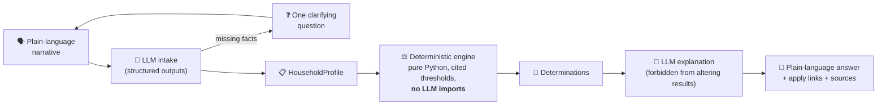

<div align="center">

# 🤲 OpenHand

**A needs-based benefits & mutual aid navigator.**

*Describe what's going on in your own words — OpenHand checks whether
public benefit programs can help, alongside (never instead of) your
local mutual aid community.*

[](https://github.com/fsecada01/openhand/actions/workflows/ci.yml)
[](LICENSE)
[](https://www.python.org/)
[](https://fastapi.tiangolo.com/)
[](https://github.com/astral-sh/ruff)
[](CONTRIBUTING.md)

[Why](#-why) · [How it works](#-how-it-works) ·
[What it screens](#-what-it-screens) · [Quickstart](#-quickstart) ·
[API](#-api) · [Contributing](#-contributing) · [Roadmap](#-roadmap)

</div>

---

## 💡 Why

Mutual aid networks already do real-time, peer-to-peer triage of
needs — food, rent, utilities, medical bills, disability income —
that overlap heavily with existing government programs (SNAP,
Medicaid/CHIP, Medicare, EITC). But the people asking rarely know
which formal programs they already qualify for.

This project grew out of categorizing a real mutual aid thread:
**217 requests**, clustering into recurring needs that a benefit
program should often already be covering. Every request routed to a
formal program frees community funds for the gaps formal systems
don't reach.

**OpenHand is additive to mutual aid, never a replacement.**

## ⚙️ How it works

The architecture has one non-negotiable rule:

> ### The LLM extracts and explains; it **never** decides.



Three guardrails keep the part that has to be right, right:

1. **Eval harness as a hard gate** — every engine change must pass
   [`tests/eval_households.json`](tests/eval_households.json), a
   hand-verified household suite.
2. **Architecture test** — a unit test fails the build if anything in
   `app/engine/` imports the LLM layer.
3. **Cited, versioned thresholds** — every number in
   [`app/engine/thresholds.py`](app/engine/thresholds.py) carries its
   official source and effective dates, and every result shows its
   data vintage to the user.

## 📊 What it screens

| Program | Coverage | Data vintage |
|---|---|---|
| 🥕 **SNAP** | 48 states + DC | USDA FY2026 COLA tables |
| 🏥 **Medicaid** (adults) | 138% FPL expansion + non-expansion map | 2026 FPL · KFF May 2026 |
| 🧒 **Medicaid/CHIP** (children) | National bands (200% floor / 255% median) | 2026 FPL |
| 🤰 **Medicaid** (pregnancy) | National bands (138% floor / 200% common) | 2026 FPL |
| ♿ **Medicare** (disability pathway) | 24-month SSDI rule, ALS/ESRD waivers, 65+ | Statutory |
| 💵 **EITC** | All filing statuses, 0–3+ children | Tax year 2025 |

When the data can't support an honest answer (AK/HI SNAP tables,
exact per-state CHIP limits), OpenHand says **undetermined** and
points to who can help — it never guesses.

## 🚀 Quickstart

```bash
git clone https://github.com/fsecada01/openhand.git
cd openhand
uv sync --group dev
cp .env.example .env    # add your ANTHROPIC_API_KEY
just dev                # → http://127.0.0.1:8000
```

```bash
just test               # eval harness + unit + web tests
just lint               # ruff check + format check
```

**Stack:** FastAPI · SQLModel · JinjaX components + HTMX + daisyUI ·
Anthropic SDK (`claude-opus-4-8`) · slowapi · uv.

## 🐳 Docker

```bash
cp .env.example .env    # add your ANTHROPIC_API_KEY
docker compose up --build   # → http://127.0.0.1:8000
```

The sqlite database persists in the `openhand_data` named volume, not
inside the container. A container is considered up once `/healthz`
returns `200`.

CI builds and pushes `fsecada01/openhand:latest` (+ `:<git-sha>`) to
Docker Hub on every push to `main` (see
[`.github/workflows/ci.yml`](.github/workflows/ci.yml)). That job
needs two repo secrets under **Settings → Secrets and variables →
Actions**: `DOCKERHUB_USERNAME` and `DOCKERHUB_TOKEN` (a Docker Hub
access token, not your account password).

## 🔌 API

**Deterministic only** — structured profile in, determinations out.
No LLM, no persistence:

```bash
curl -X POST http://127.0.0.1:8000/api/v1/evaluate \
  -H "Content-Type: application/json" \
  -d '{
    "state": "OH", "household_size": 3,
    "monthly_gross_income": 2000, "monthly_earned_income": 2000,
    "num_children": 2, "filing_status": "head_of_household"
  }'
```

**Full flow** — narrative in, clarifying question or determinations
(+ optional explanation) out:

```bash
curl -X POST http://127.0.0.1:8000/api/v1/screen \
  -H "Content-Type: application/json" \
  -d '{"narrative": "Single mom of two in Ohio, about $2k/month",
       "explain": true}'
```

## 🗂️ Project layout

```
app/
├── engine/       ⚖️ deterministic eligibility rules (no LLM allowed)
│   └── thresholds.py   every number cited to its official source
├── llm/          🤖 intake extraction + explanation passes
├── components/   🧩 JinjaX UI components (daisyUI + HTMX)
├── routers/      🌐 web flow + /api/v1
└── models.py     🗄️ privacy-first persistence (no PII, no narratives)
tests/
├── eval_households.json   🔒 hand-verified eval gate
└── test_*.py
```

## 🤝 Contributing

Contributions are very welcome — this is exactly the kind of project
that gets better with many hands. High-impact places to start:

- 🗺️ **State data** — AK/HI SNAP tables, per-state CHIP and
  pregnancy limits (replace national bands with real state rules)
- ➕ **New programs** — LIHEAP, WIC, unemployment, HUD assistance,
  SSI/SSDI screening
- 🧪 **Eval households** — more hand-verified cases, especially edge
  cases you've seen in real life
- ♿ **Accessibility & language** — plain-language review, screen
  readers, Spanish translation
- 🔍 **Data corrections** — spot a stale threshold? File a
  [data correction issue](.github/ISSUE_TEMPLATE/data_correction.yml)
  with the official source.

Read [CONTRIBUTING.md](CONTRIBUTING.md) for setup and the engine
change rules, and our [Code of Conduct](CODE_OF_CONDUCT.md). Security
or privacy concern? See [SECURITY.md](SECURITY.md).

## 🗺️ Roadmap

- [x] **Phase 1 (now)** — conversational intake, deterministic
  screening (6 programs), plain-language results, eval gate
- [ ] Cloud deployment (public POC)
- [ ] **Phase 2** — in-app feedback → LLM ticket extraction →
  auto-filed GitHub issues; state-level rule variation; more programs
- [ ] Rules-engine backends: evaluate PolicyEngine US / OpenFisca-US
  for full microsimulation
- [ ] **Phase 3 (explicitly gated)** — financial-institution
  verification, only after trust, certifications (SOC 2), and
  sustainable backing exist

## 🔒 Privacy & disclaimer

This population is a known target for scams, so the bar is high:

- **No PII, ever.** No names, handles, addresses, or payment info
  are collected or stored.
- **Narratives are not persisted** (`STORE_NARRATIVES=false`) — only
  the structured profile and determinations, anonymously.
- **Screening estimates, not decisions.** Only the agency that runs
  each program can determine eligibility. OpenHand is not legal,
  financial, or benefits advice.

## 🙏 Prior art & thanks

Standing on the shoulders of
[ACCESS NYC Rules](https://github.com/NYCOpportunity/ACCESS-NYC-Rules)
· [PolicyEngine US](https://policyengine.org/us) ·
[OpenFisca](https://openfisca.org) ·
[rubyforgood/mutual-aid](https://github.com/rubyforgood/mutual-aid) —
and every mutual aid organizer doing this triage by hand, every day.

## 📄 License

[MIT](LICENSE) — free to use, fork, and build on, from day one.
